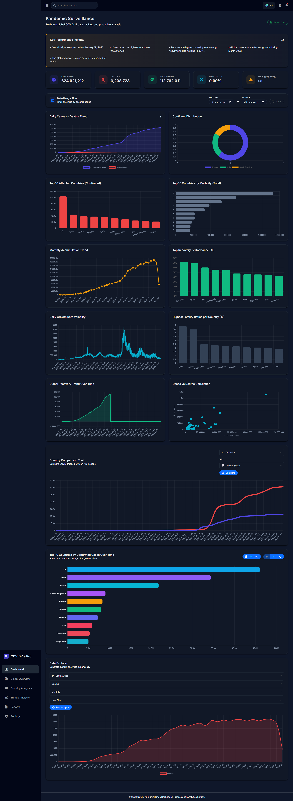
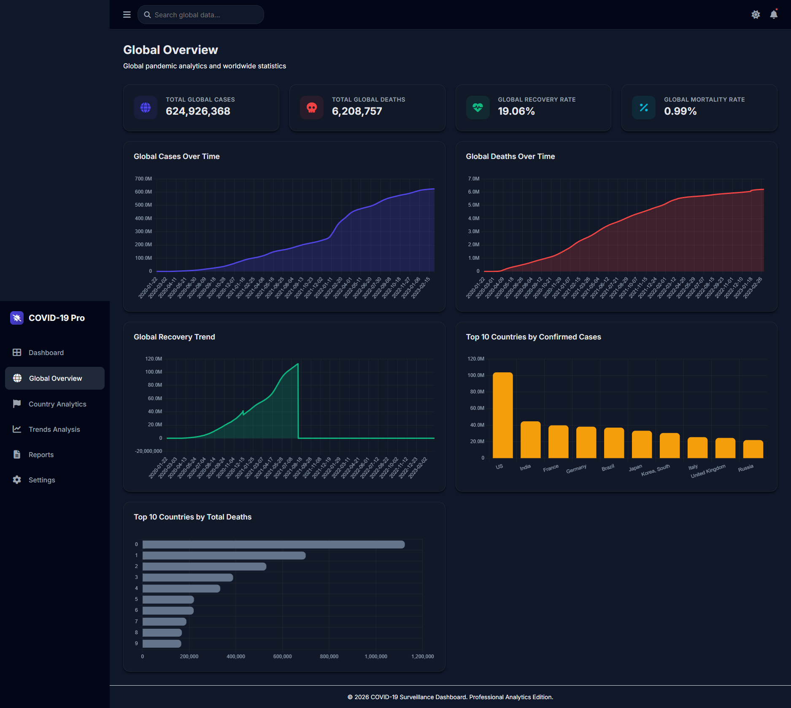
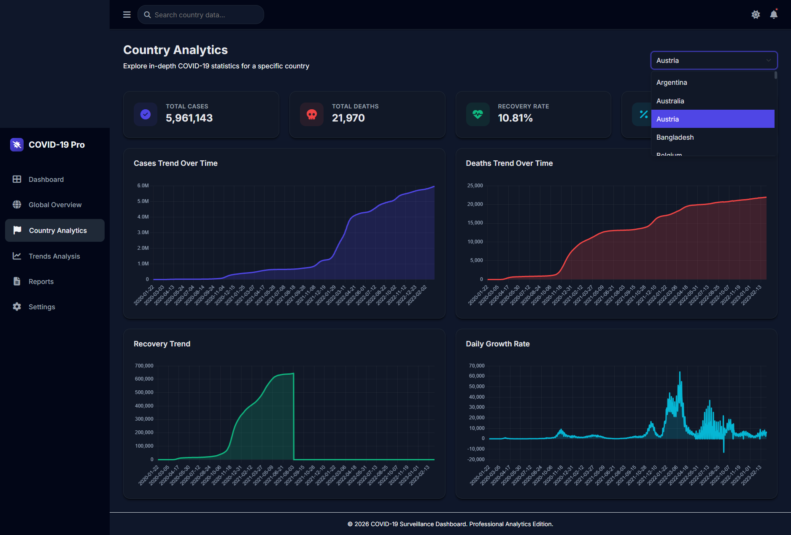
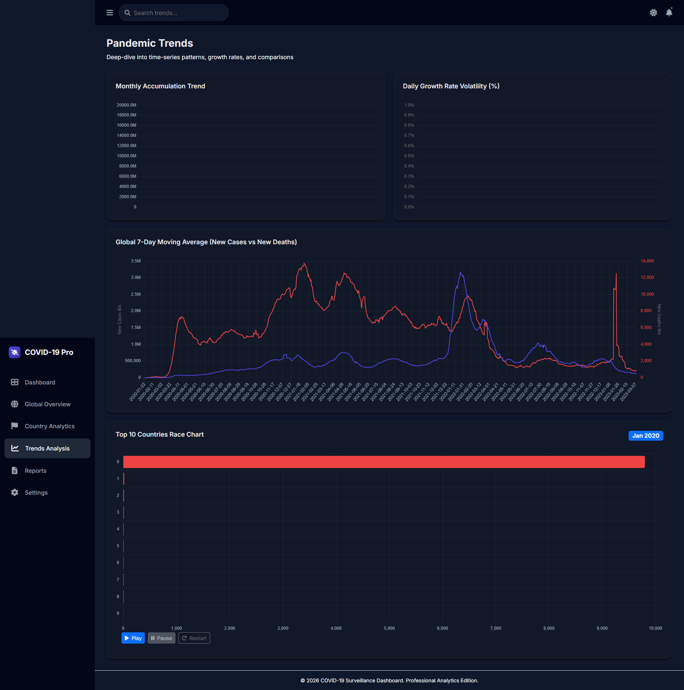

# COVID-19 Data Analytics Platform

A full-stack **interactive analytics dashboard** for exploring global COVID-19 trends using data visualization, statistical analysis, and dynamic dashboards.

This platform transforms raw pandemic data into **interactive insights**, enabling users to analyze global trends, compare countries, detect anomalies, and generate reports.

---

# Dashboard Preview

## Main Dashboard



## Global Overview



## Country Analytics



## Trends Analysis



## Data Explorer


---

# Key Features

## Interactive Analytics

• KPI performance indicators
• Time-series visualizations
• Scatter correlation analysis
• Monthly trend analysis
• Recovery performance charts

## Advanced Visualizations

• Heatmap analytics
• Anomaly detection for spikes
• Animated race chart (country ranking over time)
• Growth rate volatility tracking

## Exploration Tools

• Country comparison tool
• Interactive date range filter
• Data explorer for custom analytics queries

## Reporting

• Export dashboard reports to **PDF**
• Download dataset as **CSV**

## Smart Insights

• Automated insight panel highlighting key patterns
• Detection of unusual spikes in pandemic trends

---

# Platform Architecture

```
                   ┌────────────────────┐
                   │    Web Browser     │
                   │  (Dashboard UI)   │
                   └─────────┬──────────┘
                             │
                             │ HTTP Requests
                             ▼
                   ┌────────────────────┐
                   │     Flask App      │
                   │  API + Routing     │
                   └─────────┬──────────┘
                             │
                  Data Processing Layer
                             ▼
                   ┌────────────────────┐
                   │      Pandas        │
                   │ Data Aggregation   │
                   │ Statistical Logic  │
                   └─────────┬──────────┘
                             │
                             ▼
                   ┌────────────────────┐
                   │       MySQL        │
                   │  COVID Dataset DB  │
                   └────────────────────┘
```

---

# Technology Stack

### Backend

• Python
• Flask
• Pandas
• MySQL

### Frontend

• HTML5
• CSS3
• JavaScript

### Visualization

• Chart.js
• Heatmap visualization
• Scatter analytics

### Data Source

Johns Hopkins CSSE COVID-19 Dataset

---

# Project Structure

```
covid-dashboard/
│
├── backend/
│   ├── app.py
│   ├── config.py
│
├── dataset/
│   ├── confirmed.csv
│   ├── deaths.csv
│   ├── recovered.csv
│
├── scripts/
│   ├── prepare_dataset.py
│   ├── load_data_mysql.py
│
├── templates/
│   ├── dashboard.html
│   ├── global_overview.html
│   ├── country_analytics.html
│   ├── trends.html
│   ├── reports.html
│   ├── settings.html
│
├── static/
│   ├── css/
│   ├── js/
│
├── screenshots/
│   ├── dashboard.png
│   ├── global_overview.png
│   ├── trends.png
│
└── README.md
```

---

# Installation

## 1 Clone the repository

```
git clone https://github.com/yourusername/covid-analytics-dashboard.git
cd covid-analytics-dashboard
```

---

## 2 Install dependencies

```
pip install -r requirements.txt
```

---

## 3 Start MySQL (XAMPP)

Create database:

```
covid19
```

---

## 4 Prepare dataset

```
python scripts/prepare_dataset.py
```

---

## 5 Load data into database

```
python scripts/load_data_mysql.py
```

---

## 6 Run the application

```
python run_project.py
```

Open browser:

```
http://127.0.0.1:5000
```

---

# API Endpoints

| Endpoint                 | Description                |
| ------------------------ | -------------------------- |
| `/api/top-countries`     | Top affected countries     |
| `/api/daily-trend`       | Daily confirmed cases      |
| `/api/monthly-trend`     | Monthly accumulation       |
| `/api/mortality-ranking` | Mortality comparison       |
| `/api/country-data`      | Country specific analytics |
| `/api/key-insights`      | Automated insights         |
| `/api/case-anomalies`    | Outlier detection          |

---

# Example Insights Generated

• Global COVID cases peaked in **April 2021**
• United States recorded the **highest total infections**
• India experienced the **fastest case growth spike** in 2021

---

# Future Improvements

• Machine learning forecasting models
• Real-time streaming data integration
• Geographic map analytics
• User authentication and multi-tenant dashboards

---

# Author

**Pratham Debnath**

MCA Student — SRM University

